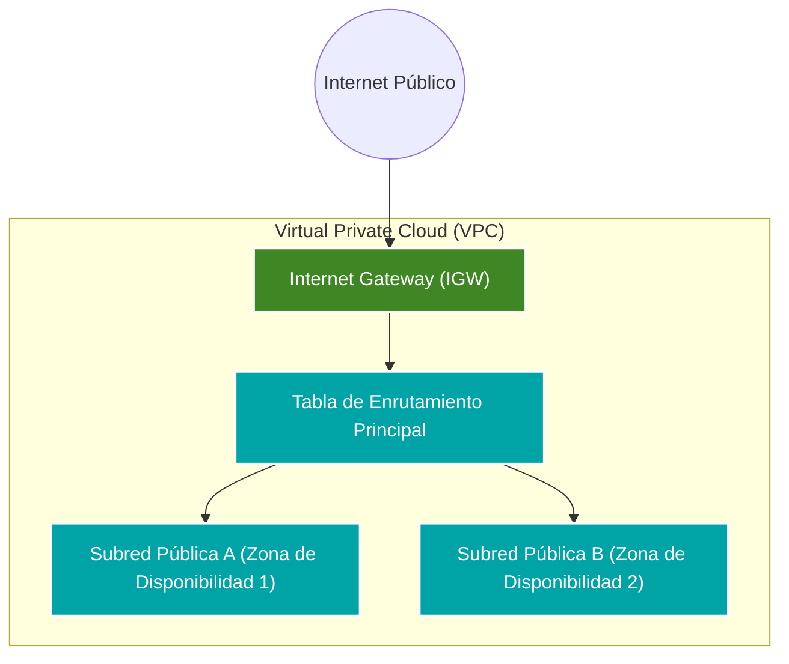

<div align="center">
  
  
</div>

<br>

# AWS Networking Module (VPC)

Este repositorio contiene un módulo reutilizable de Terraform diseñado para el aprovisionamiento automatizado de una topología de red virtual (VPC) en Amazon Web Services (AWS). La arquitectura subyacente sigue los principios de segmentación, escalabilidad y alta disponibilidad.

## Arquitectura de Red

El siguiente diagrama de flujo de datos (DFD) ilustra la disposición lógica de los componentes de red provisionados por este módulo.


## Características de Implementación

Segmentación de Red: Creación de bloques CIDR dedicados para entornos aislados.

Alta Disponibilidad: Distribución de subredes públicas a través de múltiples Zonas de Disponibilidad (AZs) para tolerancia a fallos.

Enrutamiento Explícito: Configuración integral de tablas de rutas e Internet Gateways para garantizar conectividad controlada hacia el exterior.

```
module "networking" {
  source                = "git::[https://github.com/BPainemilla-IaC-Org/terraform-aws-vpc-module.git?ref=v1.0.0](https://github.com/BPainemilla-IaC-Org/terraform-aws-vpc-module.git?ref=v1.0.0)"
  vpc_name              = "Entorno-Produccion-VPC"
  vpc_cidr_block        = "10.0.0.0/16"
  subnet_a_cidr         = "10.0.1.0/24"
  subnet_b_cidr         = "10.0.2.0/24"
  subnet_a_az           = "us-east-1a"
  subnet_b_az           = "us-east-1b"
  internet_gateway_name = "IGW-Produccion"
  route_table_name      = "RT-Publica"
}
```
### Variables de Entrada (Inputs)

| Nombre | Descripción | Tipo | Defecto | Obligatorio |
| :--- | :--- | :--- | :--- | :---: |
| `vpc_cidr_block` | Bloque CIDR base asignado a la VPC. | `string` | N/A | **Sí** |
| `vpc_name` | Etiqueta identificadora (Name tag) para la VPC. | `string` | N/A | **Sí** |
| `subnet_a_cidr` | Bloque CIDR asignado a la Subred Pública A. | `string` | N/A | **Sí** |
| `subnet_b_cidr` | Bloque CIDR asignado a la Subred Pública B. | `string` | N/A | **Sí** |
| `subnet_a_az` | Zona de Disponibilidad (AZ) destino para la Subred A. | `string` | N/A | **Sí** |
| `subnet_b_az` | Zona de Disponibilidad (AZ) destino para la Subred B. | `string` | N/A | **Sí** |

### Variables de Salida (Outputs)

| Nombre | Descripción |
| :--- | :--- |
| `vpc_id` | Identificador único de la VPC generada por la API de AWS. |
| `subnet_public_a_id` | ID físico de la subred pública aprovisionada en la primera AZ. |
| `subnet_public_b_id` | ID físico de la subred pública aprovisionada en la segunda AZ. |
